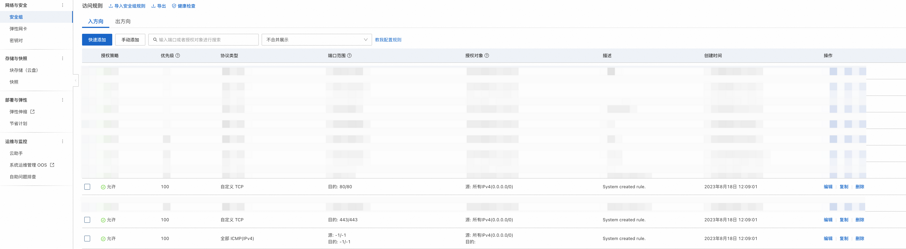
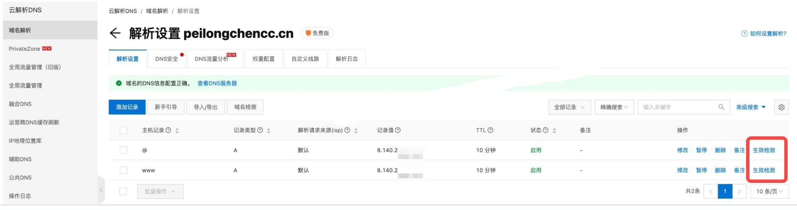

# 云服务器中服务部署流程

本章以阿里云服务器为例，介绍云服务器(笔者使用的 ubuntu 22.04)中服务部署流程。
- [云服务器中服务部署流程](#云服务器中服务部署流程)
  - [代码准备:](#代码准备)
  - [域名配置:](#域名配置)
    - [域名购买与实名认证:](#域名购买与实名认证)
    - [域名解析配置:](#域名解析配置)
      - [1. 登录阿里云DNS产品控制台:](#1-登录阿里云dns产品控制台)
      - [2. 添加主机记录:](#2-添加主机记录)
      - [主机记录使用详解(可选):](#主机记录使用详解可选)
      - [3. ICP备案(初次购买域名查看):](#3-icp备案初次购买域名查看)
    - [服务器开启端口(初次操作查看)：](#服务器开启端口初次操作查看)
      - [阿里云服务器开放方式:](#阿里云服务器开放方式)
    - [域名生效检测:](#域名生效检测)
  - [SSL证书获取:](#ssl证书获取)
    - [1. 安装 Certbot 和 Nginx 插件:](#1-安装-certbot-和-nginx-插件)
    - [2. SSL/TLS 证书获取:](#2-ssltls-证书获取)
    - [SSL证书和链文件保存位置(可跳过):](#ssl证书和链文件保存位置可跳过)
    - [Certbot获取SSL证书的优势(可跳过):](#certbot获取ssl证书的优势可跳过)
    - [cannot import name 'appengine' from 'urllib3.contrib'错误解决(可跳过):](#cannot-import-name-appengine-from-urllib3contrib错误解决可跳过)
    - [详细的操作示例如下:](#详细的操作示例如下)
      - [解决方案:](#解决方案)
    - [Certbot 写入 Nginx 的操作含义(可跳过)：](#certbot-写入-nginx-的操作含义可跳过)
    - [验证SSL证书是否有效(可选):](#验证ssl证书是否有效可选)
  - [Nginx配置:](#nginx配置)
    - [Websockets服务的Nginx配置:](#websockets服务的nginx配置)
      - [1. 为个人域名创建Nginx配置文件:](#1-为个人域名创建nginx配置文件)
      - [2. 添加配置:](#2-添加配置)
    - [https服务的Nginx配置:](#https服务的nginx配置)
      - [1. 为个人域名创建Nginx配置文件:](#1-为个人域名创建nginx配置文件-1)
      - [2. 添加配置:](#2-添加配置-1)
    - [配置软链接到 `sites-enabled`:](#配置软链接到-sites-enabled)
    - [检查配置文件的语法并重载Nginx配置:](#检查配置文件的语法并重载nginx配置)
      - [1. 检查配置文件的语法是否正确:](#1-检查配置文件的语法是否正确)
      - [2. 重新加载Nginx配置:](#2-重新加载nginx配置)
  - [关闭公网IP访问方式:](#关闭公网ip访问方式)
  - [前端dist文件借助Nginx启动服务(可选):](#前端dist文件借助nginx启动服务可选)
    - [1. 域名创建于解析:](#1-域名创建于解析)
    - [2. 域名SSL证书获取:](#2-域名ssl证书获取)
    - [3. 配置Nginx:](#3-配置nginx)
    - [附录: 端口监测取消](#附录-端口监测取消)
  - [附录--重定向 HTTP 到 HTTPS(可跳过):](#附录--重定向-http-到-https可跳过)
  - [附录--Nginx配置中哪部分表示了"www"记录？哪部分表示了"@"记录？](#附录--nginx配置中哪部分表示了www记录哪部分表示了记录)


## 代码准备:

```python
"""
File: main.py
Description: Gradio极简流式输出代码示例。
Notes: 由于Gradio起的服务含页面，所以以此作为示例。
Requirements: pip install gradio
"""
import time
import gradio as gr

def slow_echo(message, history):
    for i in range(len(message)):
        time.sleep(0.3)
        yield "You typed: " + message[: i+1]

# 允许公网ip、域名方式访问服务，方便前期测试，后期需要关闭。
gr.ChatInterface(slow_echo).launch(server_name="0.0.0.0", server_port=8867) # 如果你想要修改端口号，可以使用该示例

# 只监听本地地址，防止通过IP直接访问
# gr.ChatInterface(slow_echo).launch(server_name="127.0.0.1", server_port=8867)
```


## 域名配置:

### 域名购买与实名认证:

笔者购买的是阿里云的域名，具体操作如下，注意创建模板进行实名认证。


实名认证后，需要阿里云审核(非常快)，然后需要注册局审核(大约1～2个小时)。

### 域名解析配置:

#### 1. 登录阿里云DNS产品控制台:

```txt
https://dns.console.aliyun.com/?spm=5176.smartservice_service_robot_chat_new.help.12.127b3f1b3EE8rv#/dns/domainList
```

#### 2. 添加主机记录:


🚨注意:

如果你是配置子域名，"主机记录" 按照 "二级域名" 和 "多级域名" 规则配置即可。

#### 主机记录使用详解(可选):

主机记录就是域名前缀，常用主机记录及含义如下:

```markdown
| 主机记录 | 说明 |
| -------- | ---- |
| www      | 表示域名 www.peilongchencc.cn |
| @        | 表示主域名 peilongchencc.cn |
| *        | 泛解析，表示满足格式 *.peilongchencc.cn 的所有域名（记录类型为“显性URL”时，不允许设置泛解析） |
| mail     | 表示域名 mail.peilongchencc.cn，常用于邮箱业务的解析设置 |
| m        | 表示域名 m.peilongchencc.cn，常用于手机版网站 |
| 二级域名 | 如 abc.peilongchencc.cn，则写 abc |
| 多级域名 | 如 cd.ab.peilongchencc.cn，则写 ab.cd |
```

记录类型要看自己的IP是什么类型，我的公网IP为 `8.140...`，是IPv4，所以选的A记录类型。

一般对于同一个IP会配 "www" 和 "@" 两种主机记录，即支持用户在网址栏输入 "www.peilongchencc.cn" 和 "peilongchencc.cn" 访问自己的服务。

#### 3. ICP备案(初次购买域名查看):

如果你是初次购买域名，实名注册域名、管理局审核通过后，还需要进行ICP备案。

> 如果你的域名已经购买，可以跳过此节内容。

🚨注意: ICP备案走的是工信部系统，需要域名实名认证2～3天后才能进行ICP备案(大概需要一周)。如果你使用的阿里云的域名，可以参考以下网址进行操作:

```txt
https://help.aliyun.com/zh/icp-filing/basic-icp-service/user-guide/for-the-first-time-the-record-process
```

### 服务器开启端口(初次操作查看)：

域名配置好，需要确保服务器的 80 端口（HTTP）和 443 端口（HTTPS）是开放的，因为这是 web 服务的标准端口。只有这样才能使用户通过标准的HTTP或HTTPS协议访问你的服务，同时提高用户体验和安全性。

#### 阿里云服务器开放方式:

选择实例 --> 安全组规则 --> 入方向(不需配置出方向) --> 快速添加，效果如下图:



### 域名生效检测:

端口开放后，可以试一下刚刚创建的域名是否有效，是否可以访问成功:




## SSL证书获取:

域名配置好、生效后，必须为域名添加SSL证书，才能实现HTTPS访问。

### 1. 安装 Certbot 和 Nginx 插件:

```bash
# 更新软件包索引
sudo apt update
# 安装 Certbot 和 Nginx 插件
sudo apt install certbot python3-certbot-nginx
```

### 2. SSL/TLS 证书获取:

为指定的域名获取一个(新的) SSL/TLS 证书方式有很多，笔者使用的是`Let's Encrypt`（Certbot是Let's Encrypt中的获取工具）。

笔者可以从以下两种形式，根据自己的情况自主选择获取方式:

> 注意将域名修改为你自己的域名。

1. 如果你希望 Certbot 自动完成证书获取和 Nginx 配置，那么直接使用 `certbot --nginx` 是更方便的选择。

```bash
# 不使用 certonly 更适合希望简单快捷地部署 HTTPS 的用户，让 Certbot 自动完成所有步骤。
sudo certbot --nginx -d www.peilongchencc.cn
```

2. 如果你希望 Certbot 只获取证书，并且自行配置 Nginx，使用 `certonly` 选项。(笔者使用的方式)

```bash
# 使用 certonly 更适合那些有特定需求的用户，比如你需要手动配置、使用不同的证书管理工具，或者你不希望 Certbot 自动修改 Nginx 配置。
sudo certbot certonly --nginx -d www.peilongchencc.cn
```

💢注意: 如果你的服务器没有打开80和443端口，是无法使用 Cerbot 获取SSL证书的。

### SSL证书和链文件保存位置(可跳过):

🌈获得的SSL证书和链文件固定保存在 `/etc/letsencrypt/live` 路径，例如:

```bash
(langchain) root@iZ2ze50qtwycx9cbbvesvxZ:/project# cd /etc/letsencrypt/live
(langchain) root@iZ2ze50qtwycx9cbbvesvxZ:/etc/letsencrypt/live# ll
total 20
drwx------ 4 root root 4096 Sep  4 13:41 ./
drwxr-xr-x 9 root root 4096 Sep  4 13:41 ../
-rw-r--r-- 1 root root  740 Sep  4 13:35 README
drwxr-xr-x 2 root root 4096 Sep  4 13:41 www.peilongchencc.cn/
drwxr-xr-x 2 root root 4096 Sep  4 13:41 sys-custom.peilongchencc.cn/
drwxr-xr-x 2 root root 4096 Sep  4 13:35 sys-user.peilongchencc.cn/
(langchain) root@iZ2ze50qtwycx9cbbvesvxZ:/etc/letsencrypt/live# 
```

Certbot获取的证书有效期为90天，未来要更新或修改证书时可以再次运行 Certbot。也可以使用 `certbot renew` 命令自动更新所有证书，或者使用`crontab`进行监测。

### Certbot获取SSL证书的优势(可跳过):

1. Certbot获取的SSL证书是免费的，阿里云的SSL证书一年4000¥以上。

2. 连接Certbot不需要开通代理，正常网络连接即可。

### cannot import name 'appengine' from 'urllib3.contrib'错误解决(可跳过):

由于 Certbot 默认情况下使用系统自带的 Python，而不是虚拟环境中的 Python。如果你基础环境(非base)中缺少依赖，可能提示 "cannot import name 'appengine' from 'urllib3.contrib'" 错误。

### 详细的操作示例如下:

```log
(tmp) root@iZ2ze50qtwycx9cbbvesvxZ:/project/chenpeilong/ssl_connect# which python
/root/anaconda3/envs/tmp/bin/python
(tmp) root@iZ2ze50qtwycx9cbbvesvxZ:/project/chenpeilong/ssl_connect# python --version
Python 3.12.4
(tmp) root@iZ2ze50qtwycx9cbbvesvxZ:/project/chenpeilong/ssl_connect# sudo certbot --nginx -d www.peilongchencc.cn
Traceback (most recent call last):
  File "/usr/lib/python3/dist-packages/requests_toolbelt/_compat.py", line 48, in <module>
  # 其他错误省略
  File "/usr/lib/python3/dist-packages/requests_toolbelt/_compat.py", line 50, in <module>
    from urllib3.contrib import appengine as gaecontrib
ImportError: cannot import name 'appengine' from 'urllib3.contrib' (/usr/local/lib/python3.10/dist-packages/urllib3/contrib/__init__.py)
root@iZ2ze50qtwycx9cbbvesvxZ:/project/chenpeilong/ssl_connect# which python
root@iZ2ze50qtwycx9cbbvesvxZ:/project/chenpeilong/ssl_connect# python --version
Command 'python' not found, did you mean:
  command 'python3' from deb python3
  command 'python' from deb python-is-python3
root@iZ2ze50qtwycx9cbbvesvxZ:/project/chenpeilong/ssl_connect# python3 --version
Python 3.10.12
root@iZ2ze50qtwycx9cbbvesvxZ:/project/chenpeilong/ssl_connect# 
```

> 注意看你的系统配置，如果 `python --version` 不显示内容，试试 `python3 --version`。

从以上信息可以看出，Certbot 使用的是基础环境中的 python 3.10，而不是虚拟环境中的 python 3.12。

#### 解决方案:

在基础环境(非base)运行下列指令:

```bash
# 卸载
pip uninstall urllib3 requests_toolbelt
# 重新安装
pip install urllib3 requests_toolbelt
```

### Certbot 写入 Nginx 的操作含义(可跳过)：

如果你使用 Certbot 自动完成证书获取和 Nginx 配置，Certbot 主要做了以下工作：

1. **创建或修改了 Nginx 配置**：它将证书路径（`fullchain.pem` 和 `privkey.pem`）写入到了 Nginx 的站点配置文件中，通常在 `/etc/nginx/sites-enabled/default` 或类似文件里。这意味着访问 `https://www.peilongchencc.cn` 时，Nginx 会使用刚刚生成的 SSL 证书。

2. **配置了 HTTPS 监听**：Certbot 会让 Nginx 监听 443 端口，处理 HTTPS 请求。

🚨注意: 

**以上工作不包括与后端服务的绑定**，Certbot 的工作仅限于 SSL 证书的生成和 Nginx 的 HTTPS 配置。

如果想要将域名和后端服务绑定，还需要手动修改 Nginx 的配置文件来将你的域名（`www.peilongchencc.cn`）请求转发到后端服务。🔥

### 验证SSL证书是否有效(可选):

使用 openssl 命令：在服务器上，你可以使用 openssl 命令行工具来检查 SSL 证书。运行以下命令来检查证书：<br>

```bash
openssl s_client -connect peilongchencc.cn:443 -servername peilongchencc.cn
```

这将连接到你的服务器并显示 SSL 证书的详细信息，包括证书链和任何错误。<br>


## Nginx配置:

假设现在你已经配好了域名(`www.peilongchencc.cn`)，并申请了SSL证书。要实现域名和后端服务连接，还需要在`sites-available`中写入配置文件。

🚨由于笔者的代码是基于Gradio实现的，Gradio 的 `demo.launch()` 使用 WebSocket 来实现流式响应，而 Nginx 默认不支持 WebSocket，需要专门配置以允许 WebSocket 连接。

💢如果你不在Nginx中添加WebSockets配置，会出现 `ip+port` 访问服务时为流式输出，域名访问时为非流式输出的情况。

🌈读者可以根据自己代码情况从 **Websockets服务的Nginx配置** 和 **https服务的Nginx配置** 选一项配置自己的Nginx。

### Websockets服务的Nginx配置:

#### 1. 为个人域名创建Nginx配置文件:

```bash
vim /etc/nginx/sites-available/www.peilongchencc.cn
```

#### 2. 添加配置:

```conf
server {
    listen 80;  # 监听 80 端口，用于处理 HTTP 请求
    server_name peilongchencc.cn www.peilongchencc.cn;  # 定义服务器的域名，允许通过 peilongchencc.cn 和 www.peilongchencc.cn 访问

    # 将所有 HTTP 请求永久重定向到 HTTPS
    # 301 状态码表示永久重定向，$host 代表请求的主机，$request_uri 代表请求的 URI
    return 301 https://$host$request_uri;
}

server {
    listen 443 ssl;  # 监听 443 端口，启用 SSL（即 HTTPS）
    server_name peilongchencc.cn www.peilongchencc.cn;  # 定义服务器的域名，允许通过 peilongchencc.cn 和 www.peilongchencc.cn 访问

    # SSL 证书配置，用于加密 HTTPS 连接
    ssl_certificate /etc/letsencrypt/live/www.peilongchencc.cn/fullchain.pem;  # 定义 SSL 证书的完整链路径
    ssl_certificate_key /etc/letsencrypt/live/www.peilongchencc.cn/privkey.pem;  # 定义 SSL 证书的私钥路径

    # 配置 WebSocket 代理
    location / {
        # 将所有请求代理到本地 7860 端口上的应用
        proxy_pass http://localhost:7860;

        # 支持 WebSocket 连接，WebSocket 升级需要设置 HTTP/1.1 协议
        proxy_http_version 1.1;  # 使用 HTTP 1.1 协议支持 WebSocket
        proxy_set_header Upgrade $http_upgrade;  # 设置 Upgrade 头，用于处理 WebSocket 升级
        proxy_set_header Connection "upgrade";  # 将连接类型设置为 "upgrade" 以启用 WebSocket

        # 保留客户端的真实请求信息
        proxy_set_header Host $host;  # 保留客户端的 Host 头信息
        proxy_set_header X-Real-IP $remote_addr;  # 传递客户端的真实 IP 地址
        proxy_set_header X-Forwarded-For $proxy_add_x_forwarded_for;  # 传递代理链中的客户端 IP 地址
        proxy_set_header X-Forwarded-Proto $scheme;  # 保留客户端的协议（HTTP 或 HTTPS）

        # 防止超时(任何一个时刻超过 60 秒没有数据传输)
        # 如果超过 60 秒没有数据传输，则可能触发超时错误，proxy_read_timeout 和 proxy_send_timeout 用于防止此类问题
        # 以流式输出举例，如果程序一直在输出内容，超过60s也不会报错。
        proxy_read_timeout 60s;  # 允许 Nginx 等待后端服务器的响应，最长不超过 60 秒
        proxy_send_timeout 60s;  # 允许 Nginx 发送数据到后端服务器的时间限制，最长不超过 60 秒
    }
}
```

### https服务的Nginx配置:

#### 1. 为个人域名创建Nginx配置文件:

```bash
vim /etc/nginx/sites-available/www.peilongchencc.cn
```

#### 2. 添加配置:

```conf
server {
    listen 80;  # 监听 80 端口，处理 HTTP 请求
    server_name peilongchencc.cn www.peilongchencc.cn;  # 定义服务器域名，可以通过 peilongchencc.cn 或 www.peilongchencc.cn 访问

    # 将所有通过 HTTP 的请求重定向到 HTTPS
    # 301 是永久重定向，$host 表示请求的主机名，$request_uri 表示请求的 URI
    return 301 https://$host$request_uri;
}

server {
    listen 443 ssl;  # 监听 443 端口，启用 SSL（HTTPS）来处理加密连接
    server_name peilongchencc.cn www.peilongchencc.cn;  # 定义服务器域名，可以通过 peilongchencc.cn 或 www.peilongchencc.cn 访问

    # SSL 证书和私钥的路径，Nginx 用于加密 HTTPS 连接
    ssl_certificate /etc/letsencrypt/live/www.peilongchencc.cn/fullchain.pem;  # SSL 证书的完整链路径
    ssl_certificate_key /etc/letsencrypt/live/www.peilongchencc.cn/privkey.pem;  # SSL 私钥的路径

    # 其他 SSL 配置可以在这里补充，比如 SSL 协议和密码套件设置...

    # 处理所有路径的请求，进行反向代理
    location / {
        proxy_pass http://localhost:7860;  # 将所有请求代理到本地主机的 7860 端口上的服务
        proxy_set_header Host $host;  # 保持客户端的 Host 请求头
        proxy_set_header X-Real-IP $remote_addr;  # 设置客户端真实的 IP 地址
        proxy_set_header X-Forwarded-For $proxy_add_x_forwarded_for;  # 保留客户端 IP 地址，加入代理链中
        proxy_set_header X-Forwarded-Proto $scheme;  # 将原始的协议（HTTP 或 HTTPS）传递给后端服务器
    }
}
```

### 配置软链接到 `sites-enabled`:

软链接类似快捷方式，可以让Nginx更快检索。具体操作如下:

```bash
sudo ln -s /etc/nginx/sites-available/www.peilongchencc.cn /etc/nginx/sites-enabled/
```

### 检查配置文件的语法并重载Nginx配置:

假定你现在已经按照上述操作将Nginx配置导入了自己的Nginx配置，现在请按照以下步骤执行:

> 🚨注意: 如果你替换了前端dist文件，也要重载Nginx配置才能生效，界面才能更改。

#### 1. 检查配置文件的语法是否正确:

```bash
sudo nginx -t
```

#### 2. 重新加载Nginx配置:

如果没有配置文件的语法正确，重新加载Nginx配置(不关闭 Nginx 的情况使修改后的配置文件生效):

```bash
sudo systemctl reload nginx
```

🌈完成这些步骤后，且你的ICP备案通过，用户就可以通过下列方式访问你的服务了:

```conf
https://peilongchencc.cn
https://www.peilongchencc.cn
# IP+PORT方式
https://8.140.203.xxx:8867
```


## 关闭公网IP访问方式:

正式环境下，我们通常不允许用户通过IP+PORT的方式访问我们的服务。`0.0.0.0`监听了公网ip，需要切换为`127.0.0.1`(本地地址)。

```python
"""
File: main.py
Description: Gradio极简流式输出代码示例。
Notes: 由于Gradio起的服务含页面，所以以此作为示例。
Requirements: pip install gradio
"""
import time
import gradio as gr

def slow_echo(message, history):
    for i in range(len(message)):
        time.sleep(0.3)
        yield "You typed: " + message[: i+1]

# 允许公网ip、域名方式访问服务，方便前期测试，后期需要关闭。
# gr.ChatInterface(slow_echo).launch(server_name="0.0.0.0", server_port=8867) # 如果你想要修改端口号，可以使用该示例

# 只监听本地地址，防止通过IP直接访问
gr.ChatInterface(slow_echo).launch(server_name="127.0.0.1", server_port=8867)
```

🔥现在用于仅可以通过下列域名的方式访问自己的服务:

```conf
https://peilongchencc.cn
https://www.peilongchencc.cn
```


## 前端dist文件借助Nginx启动服务(可选):

### 1. 域名创建于解析:

阿里云域名控制台配置自己的服务域名。

### 2. 域名SSL证书获取:

```bash
sudo certbot certonly --nginx -d bankchatbot.aistar.com
```

### 3. 配置Nginx:

```bash
vim /etc/nginx/sites-available/bankchatbot.aistar.com
```

然后填入下列内容:

```conf
server {
    listen 80;
    server_name bankchatbot.aistar.com;

    # 将所有 HTTP 请求重定向到 HTTPS
    return 301 https://$host$request_uri;
}

server {
    listen 443 ssl;
    server_name bankchatbot.aistar.com;

    # Let's Encrypt 证书和私钥路径
    ssl_certificate /etc/letsencrypt/live/bankchatbot.aistar.com/fullchain.pem;  # SSL 证书的完整链路径
    ssl_certificate_key /etc/letsencrypt/live/bankchatbot.aistar.com/privkey.pem;  # SSL 私钥的路径

    ssl_protocols TLSv1.2 TLSv1.3;
    ssl_ciphers HIGH:!aNULL:!MD5;

    # 网站根目录和首页设置
    root /project/chenpeilong/bank_chatbot/front_end_services;
    index index.html;

    location / {
        try_files $uri $uri/ /index.html;
    }
}
```

### 附录: 端口监测取消

如果你之前的配置中有 `listen 8101;`，那说明 Nginx 当时是监听在 `8101` 端口上，用户需要通过 `http://your-ip:8101` 的方式来访问应用。

现在你已经将访问切换到通过域名 `bankchatbot.aistar.com`，并且你还申请了 SSL 证书，那么通常情况下只需要监听 **80** 和 **443** 端口，不再需要监听 `8101`，因为标准的 HTTP 和 HTTPS 端口分别是 80 和 443。

所以，如果你不再需要通过 `8101` 端口来访问，可以移除对该端口的监听。新的配置文件应该只监听标准的 80 和 443 端口。


## 附录--重定向 HTTP 到 HTTPS(可跳过):

**Question:** 我想要将所有通过 HTTP 访问的流量重定向到 HTTPS，这种情况下我还需要开通服务器的 80 端口吗？

**Answer:** 即使你打算将所有通过 HTTP 访问的流量重定向到 HTTPS，你仍然需要开放服务器的 80 端口。这是因为初始的 HTTP 请求首先会到达 80 端口，然后才会被服务器重定向到 443 端口（HTTPS）。如果不开放 80 端口，那么初始的 HTTP 请求就无法到达服务器，从而无法完成重定向。


## 附录--Nginx配置中哪部分表示了"www"记录？哪部分表示了"@"记录？

在 Nginx 配置中，server_name 指令是用来指定哪些主机名（或域名）由该服务器块处理。在提供的配置示例中，server_name 指令同时涵盖了 "www" 记录和 "@" 记录。让我解释一下：

`server_name peilongchencc.cn www.peilongchencc.cn;` 这行代码的作用是告诉 Nginx，无论是访问 "peilongchencc.cn"（这代表 "@" 记录）还是 "www.peilongchencc.cn"（这代表 "www" 记录），都由这个服务器块处理。

在 Nginx 配置中，并没有专门用来区分 "www" 记录和 "@" 记录的特定部分。server_name 指令可以接受多个域名，这意味着无论用户输入的 URL 中包含 "www" 还是不包含，只要这些域名都在 server_name 指令中列出，Nginx 都会为它们提供服务。

上述Nginx配置能够处理同时指向 "peilongchencc.cn" 和 "www.peilongchencc.cn" 的请求。这样做的好处是无论用户访问哪个版本的域名（无论是带 "www" 还是不带），他们都能够访问到同一个网站。