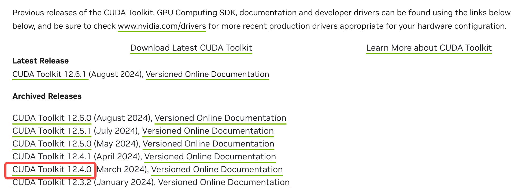
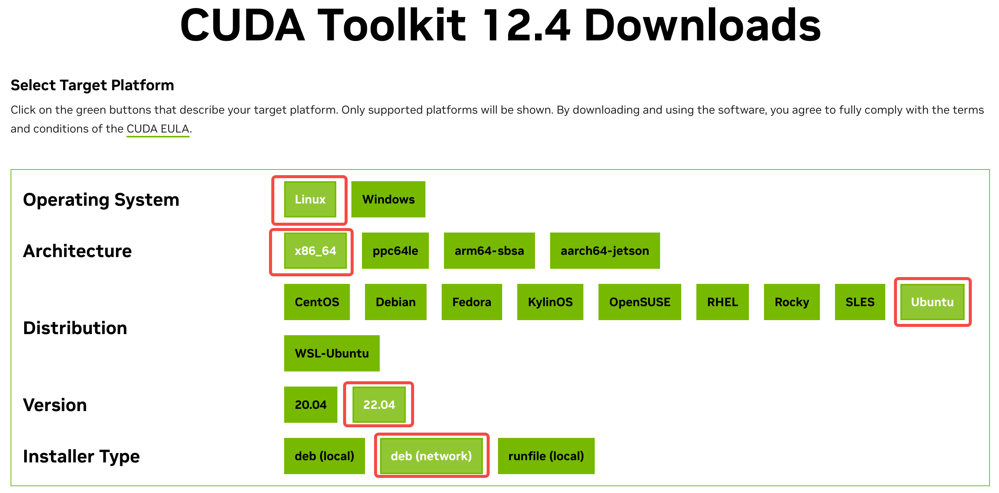

# CUDA工具包安装

在使用云服务器的过程中，总会遇到厂商各种CUDA工具包安装有问题的情况。本章介绍笔者安装CUDA工具包的一些经验。
- [CUDA工具包安装](#cuda工具包安装)
  - [nvidia-cuda-toolkit安装:](#nvidia-cuda-toolkit安装)
    - [服务器信息:](#服务器信息)
    - [拓展-安装vllm:](#拓展-安装vllm)
    - [1. nvidia-cuda-toolkit官网选择合适的版本:](#1-nvidia-cuda-toolkit官网选择合适的版本)
    - [2. 配置下载指令:](#2-配置下载指令)
    - [3. 查看nvcc版本:](#3-查看nvcc版本)
    - [笔者的安装过程节选(可选):](#笔者的安装过程节选可选)
      - [1. 查看CUDA路径:](#1-查看cuda路径)
      - [2. 检查和更新符号链接:](#2-检查和更新符号链接)
      - [3. 验证 `nvcc` 版本:](#3-验证-nvcc-版本)
      - [4. 更新环境变量](#4-更新环境变量)
      - [5. 验证 CUDA 编译器版本](#5-验证-cuda-编译器版本)
      - [6. 重新启动系统(慎用):](#6-重新启动系统慎用)


## nvidia-cuda-toolkit安装:

### 服务器信息:

笔者租用的是 ubuntu 22.04 4090 显卡，具体信息如下:

```log
(hospital_feedback) root@ubuntu22:/data/hospital_feedback_system# nvcc -V
nvcc: NVIDIA (R) Cuda compiler driver
Copyright (c) 2005-2021 NVIDIA Corporation
Built on Thu_Nov_18_09:45:30_PST_2021
Cuda compilation tools, release 11.5, V11.5.119
Build cuda_11.5.r11.5/compiler.30672275_0
(hospital_feedback) root@ubuntu22:/data/hospital_feedback_system# nvidia-smi
Sat Sep 21 19:42:00 2024       
+-----------------------------------------------------------------------------------------+
| NVIDIA-SMI 550.78                 Driver Version: 550.78         CUDA Version: 12.4     |
|-----------------------------------------+------------------------+----------------------+
| GPU  Name                 Persistence-M | Bus-Id          Disp.A | Volatile Uncorr. ECC |
| Fan  Temp   Perf          Pwr:Usage/Cap |           Memory-Usage | GPU-Util  Compute M. |
|                                         |                        |               MIG M. |
|=========================================+========================+======================|
|   0  NVIDIA GeForce RTX 4090        Off |   00000000:00:08.0 Off |                  Off |
|  0%   34C    P8             30W /  450W |      12MiB /  24564MiB |      0%      Default |
|                                         |                        |                  N/A |
+-----------------------------------------+------------------------+----------------------+
                                                                                         
+-----------------------------------------------------------------------------------------+
| Processes:                                                                              |
|  GPU   GI   CI        PID   Type   Process name                              GPU Memory |
|        ID   ID                                                               Usage      |
|=========================================================================================|
|    0   N/A  N/A       781      G   /usr/lib/xorg/Xorg                              4MiB |
+-----------------------------------------------------------------------------------------+
(hospital_feedback) root@ubuntu22:/data/hospital_feedback_system# 
```

### 拓展-安装vllm:

假设你想要安装vllm，vllm官方提示 "Install vLLM with CUDA 12.1" 。你了解这是什么意思吗？

vLLM 官方的提示 "Install vLLM with CUDA 12.1" 是指 vLLM 依赖于 CUDA 12.1 或以上版本来进行加速。根据笔者的系统信息:

🚨 笔者的 `nvcc` 版本是 11.5，表示笔者系统中安装的 CUDA 工具链是 11.5 版本的。

但是，在 `nvidia-smi` 输出中显示笔者的 NVIDIA 驱动支持的 CUDA 版本是 **12.4** (`Driver Version: 550.78`, `CUDA Version: 12.4`)，这意味着笔者的驱动实际上已经支持 CUDA 12.4。此时最好将 nvidia-cuda-toolkit 升级到12.4版本。

### 1. nvidia-cuda-toolkit官网选择合适的版本:

nvidia-cuda-toolkit官网链接:

```log
https://developer.nvidia.com/cuda-toolkit-archive
```

笔者 `nvidia-smi` 显示当前系统的驱动版本支持 **CUDA 12.4**。故选择:



不选 **CUDA 12.4.1** 是为了 CUDA 工具链版本会与 GPU 驱动版本更匹配，确保最大化性能并避免可能的兼容性问题。

### 2. 配置下载指令:

根据个人系统，配置CUDA工具包下载指令:



简单介绍一下图中的 **安装类型 (Installer Type)**:

   - deb (local): 适合下载 `.deb` 文件并在本地进行安装。

   - deb (network):通过网络从 NVIDIA 官方源直接安装，适合你在有稳定网络连接时使用。

   - runfile (local):下载 `.run` 文件，适合你需要更灵活的手动安装控制（例如不使用包管理器的安装）。

对于大多数情况，选择 **deb (network)** 是最简单和自动化的方式，因为它会处理依赖项和自动更新。但如果你想手动管理安装，可以选择 **deb (local)** 或 **runfile (local)**。

配置好后，网页下方将显示安装方式:

```bash
wget https://developer.download.nvidia.com/compute/cuda/repos/ubuntu2204/x86_64/cuda-keyring_1.1-1_all.deb
sudo dpkg -i cuda-keyring_1.1-1_all.deb
sudo apt-get update
sudo apt-get -y install cuda-toolkit-12-4
```

### 3. 查看nvcc版本:

安装好cuda-toolkit-12-4后，输入下列指令查看安装的效果:

```bash
nvcc -V
```

现在，你应该已经可以看到CUDA工具包的版本更改为了 12.4。

### 笔者的安装过程节选(可选):

如果你成功安装了 CUDA Toolkit 12.4 以及相关的库和工具。然而，`nvcc -V` 仍然显示的是 CUDA 11.5 的编译器版本，这可能是因为旧版本的 CUDA 编译器 (`nvcc`) 仍然在环境路径中优先被调用。例如:

```log
(hospital_feedback) root@ubuntu22:/data/hospital_feedback_system# wget https://developer.download.nvidia.com/compute/cuda/repos/ubuntu2204/x86_64/cuda-keyring_1.1-1_all.deb
(hospital_feedback) root@ubuntu22:/data/hospital_feedback_system# sudo dpkg -i cuda-keyring_1.1-1_all.deb
正在选中未选择的软件包 cuda-keyring。
(正在读取数据库 ... 系统当前共安装有 225884 个文件和目录。)
准备解压 cuda-keyring_1.1-1_all.deb  ...
正在解压 cuda-keyring (1.1-1) ...
正在设置 cuda-keyring (1.1-1) ...
(hospital_feedback) root@ubuntu22:/data/hospital_feedback_system# sudo apt-get update
命中:1 https://mirrors.tuna.tsinghua.edu.cn/ubuntu jammy InRelease
命中:2 https://mirrors.tuna.tsinghua.edu.cn/ubuntu jammy-updates InRelease                                                         

# 此处省略大部分安装信息

正在设置 cuda-visual-tools-12-4 (12.4.1-1) ...
正在设置 cuda-tools-12-4 (12.4.1-1) ...
正在设置 cuda-toolkit-12-4 (12.4.1-1) ...
正在处理用于 bamfdaemon (0.5.6+22.04.20220217-0ubuntu1) 的触发器 ...
Rebuilding /usr/share/applications/bamf-2.index...
正在处理用于 desktop-file-utils (0.26-1ubuntu3) 的触发器 ...
正在处理用于 hicolor-icon-theme (0.17-2) 的触发器 ...
正在处理用于 gnome-menus (3.36.0-1ubuntu3) 的触发器 ...
正在处理用于 libc-bin (2.35-0ubuntu3.6) 的触发器 ...
正在处理用于 mailcap (3.70+nmu1ubuntu1) 的触发器 ...
(hospital_feedback) root@ubuntu22:/data/hospital_feedback_system# nvcc -V
nvcc: NVIDIA (R) Cuda compiler driver
Copyright (c) 2005-2021 NVIDIA Corporation
Built on Thu_Nov_18_09:45:30_PST_2021
Cuda compilation tools, release 11.5, V11.5.119
Build cuda_11.5.r11.5/compiler.30672275_0
(hospital_feedback) root@ubuntu22:/data/hospital_feedback_system# 
```

要解决这个问题，确保系统使用最新安装的 CUDA 12.4 的 `nvcc`，你可以尝试以下步骤：

#### 1. 查看CUDA路径:

默认的 CUDA 安装路径为 `/usr/local/cuda-12.4`，例如:

```log
(base) root@ubuntu22:/usr/local# ll
总计 4
drwxr-xr-x 11 root root  158  9月 21 20:11 ./
drwxr-xr-x 14 root root  160  2月 21  2024 ../
drwxr-xr-x  2 root root   33  9月 21 20:11 bin/
lrwxrwxrwx  1 root root   22  9月 21 20:11 cuda -> /etc/alternatives/cuda/
lrwxrwxrwx  1 root root   25  9月 21 20:11 cuda-12 -> /etc/alternatives/cuda-12/
drwxr-xr-x 15 root root 4096  9月 21 20:11 cuda-12.4/
drwxr-xr-x  2 root root    6  2月 21  2024 etc/
drwxr-xr-x  2 root root    6  2月 21  2024 games/
drwxr-xr-x  2 root root    6  2月 21  2024 include/
drwxr-xr-x  3 root root   24  2月 21  2024 lib/
lrwxrwxrwx  1 root root    9  5月  2 22:23 man -> share/man/
drwxr-xr-x  2 root root    6  2月 21  2024 sbin/
drwxr-xr-x  7 root root   76  2月 21  2024 share/
drwxr-xr-x  2 root root    6  2月 21  2024 src/
(base) root@ubuntu22:/usr/local# 
```

#### 2. 检查和更新符号链接:

你可以检查当前的 `/etc/alternatives/cuda` 和 `/etc/alternatives/cuda-12` 是否指向正确的 CUDA 版本。运行以下命令：

```bash
ls -l /etc/alternatives/cuda
ls -l /etc/alternatives/cuda-12
```

如果这些符号链接指向旧版本，你可以手动更新它们以指向 CUDA 12.4。例如:

```bash
sudo ln -sf /usr/local/cuda-12.4 /usr/local/cuda
sudo ln -sf /usr/local/cuda-12.4 /usr/local/cuda-12
```

#### 3. 验证 `nvcc` 版本:

重新设置符号链接后，再次检查 `nvcc` 版本以确认是否已更新为 **CUDA 12.4**:

```bash
nvcc -V
```

这样应该可以解决问题，使 `nvcc` 正确指向 CUDA 12.4。如果依然无法解决，可能需要进一步检查 `PATH` 和 `LD_LIBRARY_PATH`。

#### 4. 更新环境变量

在终端中编辑 `~/.bashrc` 文件，确保你的 `PATH` 和 `LD_LIBRARY_PATH` 环境变量指向新安装的 CUDA 12.4 路径:

```bash
vim ~/.bashrc
```

在文件末尾添加以下内容（默认的 CUDA 安装路径为 `/usr/local/cuda-12.4`）:

> 建议先vim输入 `:/cuda` 进行搜索，如果没有再添加。

```bash
export PATH=/usr/local/cuda-12.4/bin${PATH:+:${PATH}}
export LD_LIBRARY_PATH=/usr/local/cuda-12.4/lib64${LD_LIBRARY_PATH:+:${LD_LIBRARY_PATH}}
```

保存并关闭文件后，运行以下命令以使更改生效：

```bash
source ~/.bashrc
```

#### 5. 验证 CUDA 编译器版本

再次检查 `nvcc` 的版本以确认是否已切换到 CUDA 12.4：

```bash
nvcc -V
```

如果一切设置正确，应该显示 CUDA 12.4 的编译器版本。笔者效果:

```log
(hospital_feedback) root@ubuntu22:/usr/local# source ~/.bashrc
(base) root@ubuntu22:/usr/local# nvcc -V
nvcc: NVIDIA (R) Cuda compiler driver
Copyright (c) 2005-2024 NVIDIA Corporation
Built on Thu_Mar_28_02:18:24_PDT_2024
Cuda compilation tools, release 12.4, V12.4.131
Build cuda_12.4.r12.4/compiler.34097967_0
(base) root@ubuntu22:/usr/local#
```

#### 6. 重新启动系统(慎用):

如果你到上一步，CUDA工具包信息还没有更新。你可以尝试重新启动系统，有时，系统会在重新启动后完全加载新设置。指令如下:

```bash
sudo reboot
```

运行这个命令后，系统会立即重新启动。重新启动后，确保你再次检查 `nvcc -V` 以确认 CUDA 12.4 是否正确安装和生效。